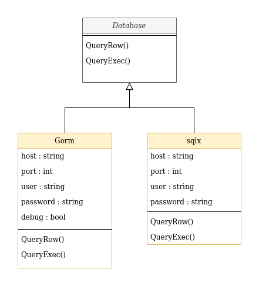

## Bridge Pattern

Bridge is used when we need to decouple an abstraction from its implementation so that the two can vary independently. This type of design pattern comes under structural pattern as this pattern decouples implementation class and abstract class by providing a bridge structure between them.

This pattern involves an interface which acts as a bridge which makes the functionality of concrete classes independent from interface implementer classes. Both types of classes can be altered structurally without affecting each other.

### Applicability

- Use the Bridge pattern when you want to divide and organize a monolithic class that has several variants of some functionality (for example, if the class can work with various database servers).
- The bigger a class becomes, the harder it is to figure out how it works, and the longer it takes to make a change. The changes made to one of the variations of functionality may require making changes across the whole class, which often results in making errors or not addressing some critical side effects.
- The Bridge pattern lets you split the monolithic class into several class hierarchies. After this, you can change the classes in each hierarchy independently of the classes in the others. This approach simplifies code maintenance and minimizes the risk of breaking existing code.
- Use the pattern when you need to extend a class in several orthogonal (independent) dimensions.
- The Bridge suggests that you extract a separate class hierarchy for each of the dimensions. The original class delegates the related work to the objects belonging to those hierarchies instead of doing everything on its own.
- Use the Bridge if you need to be able to switch implementations at runtime.
- Although it’s optional, the Bridge pattern lets you replace the implementation object inside the abstraction. It’s as easy as assigning a new value to a field.
- By the way, this last item is the main reason why so many people confuse the Bridge with the Strategy pattern. Remember that a pattern is more than just a certain way to structure your classes. It may also communicate intent and a problem being addressed.

